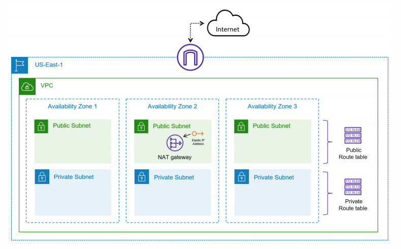

# Terraform VPC

An AWS VPC with public and private subnets, Internet Gateway, NAT Gateway, and route tables deployed using Terraform.

- Task 1: Create a new VPC in the US-East-1 region.
- Task 2: Create public and private subnets in three different Availability Zones.
- Task 3: Deploy an Internet Gateway and attach it to the VPC.
- Task 4: Provision a NAT Gateway (a single instance will do) for outbound connectivity.
- Task 5: Ensure that route tables are configured to properly route traffic based on the requirements.

